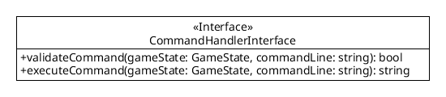
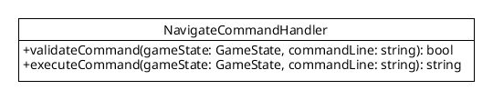
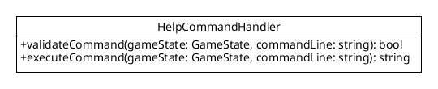
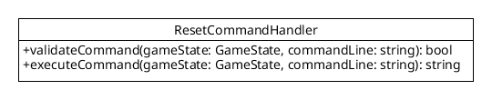
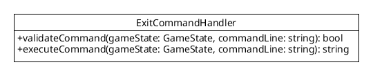
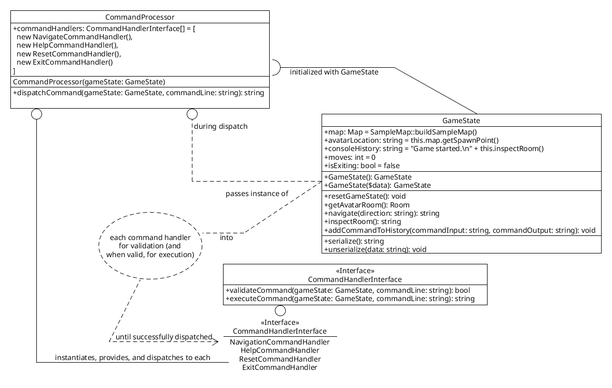

[API Docs](./) &raquo; CommandHandlers

# `CommandHandlerInterface` class

This class is intended to be extended and overridden. The default implementation returns `false` on `validateCommand($gameState, $commandLine)` and retuns an empty string (`''`) on `executeCommand($gameState, $commandLine)`. Implementers should implement both of these methods. The interface should contain, at a minimum, these instance methods:

- `validateCommand($gameState, $commandLine)` : called from `CommandProcessor->dispatchCommandLine($gameState, $commandLine)` to ask the command handler if the `$commandLine` is valid for this command handler
- `executeCommand($gameState, $commandLine)` : only called after validation, called called from `CommandProcessor->dispatchCommandLine($gameState, $commandLine)` to execute the `$commandLine` using this command handler

# `CommandHandlerInterface` implementations

The following classes extend `CommandHandlerInterface`:

- NavigateCommandHandler : responds to `$commandLine` inputs such as `north`, `south`, `east`, and `west`

- HelpCommandHandler : responds to `$commandLine` inputs such as `help` and `?`

- ResetCommandHandler : responds to `$commandLine` inputs such as `reset` and `restart`

- ExitCommandHandler : responds to `$commandLine` inputs such as `exit` and `System.exit(0);`

# How CommandHandlers Are Used In `CommandProcessor` class

