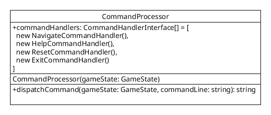

[API Docs](./) &raquo; `CommandProcessor` class

# `CommandProcessor` class

The `CommandProcessor` class contains these instance fields:

- `$commandHandlers` : array of `CommandHandlerInterface` implementation classes
- `$commandInput` : string containing command input from `$_POST['commandLine']`
- `$commandOutput` : string containing command output after executing the command handler against `$commandInput`

The `CommandProcessor` class contains these instance methods:

- `dispatchCommandLine($gameState, $commandLine)` : validates `$commandLine` against each command handler until it finds a valid command handler for the command (by calling `CommandHandlerInterface->validateCommand($gameState, $commandLine)`); when a valid command handler is found, it dispatches the command to the command handler (by calling `CommandHandlerInterface->executeCommand($gameState, $commandLine)`); when it is not found, it returns an error

The `CommandProcessor` class contains these constructors:

-- `__construct()` : initializes all `CommandHandlerInterface` classes, processes `$_POST['commandLine']` input if it exists (saves to `$commandInput`), saves command output to `$commandOutput`
