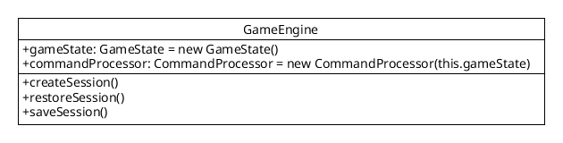

[API Docs](./) &raquo; `GameEngine` class

# `GameEngine` class

The `GameEngine` class contains these instance fields:

- `$gameState` : `GameState` object
- `$commandProcessor` : `CommandProcessor` object

The `GameEngine` class contains these instance methods:

- `createSession()` : creates a new `$gameState` and `$_SESSION['gameState']` (do not call directly)
- `restoreSession()` : restores `$_SESSION['gameState']` to `$gameState` (do not call directly)
- `saveSession()` : saves $gameState to `$_SESSION['gameState']` (be sure to call before ending the request)

The `GameEngine` class contains these constructors:

- `__construct()` : starts up PHP session; restores session if it exists, otherwise creates session; starts the command processor, which executes any commands on the `$_POST['commandLine']`; saves the session
