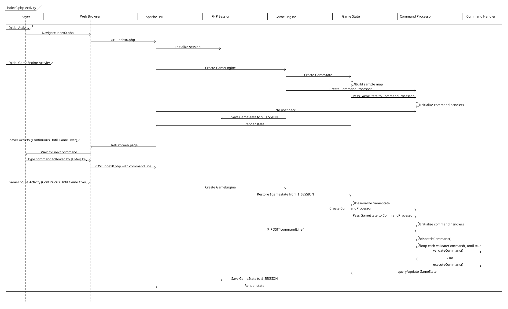

[API Docs](./) &raquo; All members

# Game Application API Reference

- [GameEngine class](./GameEngine.md)
- [CommandProcessor class](./CommandProcessor.md)
- [CommandHandlers (multiple classes)](./CommandHandlers.md)
- [GameState class](./GameState.md)

# How the API Engine is implemented

