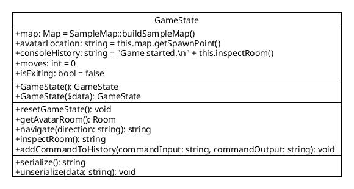

[API Docs](./) &raquo; `GameState` class

# `GameState` class

A `GameState` instance holds and manipulates all the data about the current game state, including the map, player's location, console history, number of moves, and whether or not the game is exiting.

The `GameState` class contains these instance fields, and is (un)/serializable.

- `$map` : current `Map` instance
- `$avatarLocation` : current `Room->name` for the player's location in the `$map`
- `$consoleHistory` : string with all the command line input and output (for display to the screen)
- `$moves` : number of moves the player has made
